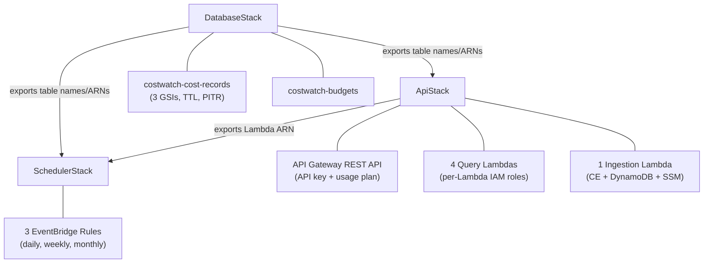
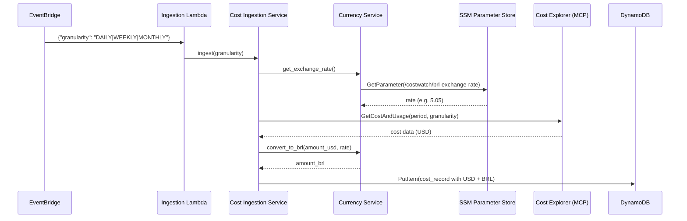
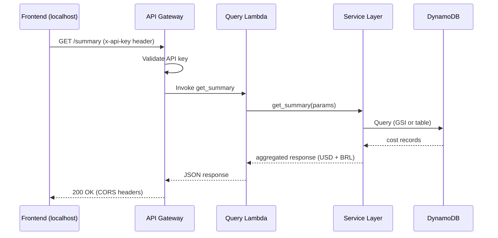

# Design Document — CostWatch AWS Cost Dashboard

## Overview

CostWatch is a serverless AWS Cost Dashboard that provides managers with real-time and historical visibility into AWS spending. The system ingests cost data from AWS Cost Explorer via the MCP Server at three granularities (DAILY, WEEKLY, MONTHLY), stores it in DynamoDB with dual-currency support (USD + BRL), and exposes it through a read-only REST API consumed by a locally-served "Dark Command Center" frontend.

### Key Design Decisions

1. **No alerting/anomaly detection** — The system is read-only. No SNS topics, alert Lambdas, or alert-configs table.
2. **No CloudFront/S3 frontend deployment** — The frontend runs locally via a live server on macOS, simplifying the infrastructure.
3. **2 DynamoDB tables** — `costwatch-cost-records` for cost data and `costwatch-budgets` for budget thresholds.
4. **3 CDK stacks** — DatabaseStack, ApiStack, SchedulerStack. No AlertStack or FrontendStack.
5. **Dual currency at ingestion time** — BRL is computed during ingestion using an exchange rate from SSM Parameter Store, so both currencies are always available without runtime conversion.
6. **Thin Lambda handlers** — All business logic lives in the service layer; handlers are pure request/response wrappers.
7. **CORS for localhost** — API Gateway allows requests from localhost origins for local frontend development.

### System Boundaries

```
┌─────────────────────────────────────────────────────────────────┐
│                        AWS Cloud (gsti-us)                       │
│                                                                   │
│  ┌──────────────┐    ┌──────────────────┐    ┌────────────────┐  │
│  │  EventBridge  │───▶│ Ingestion Lambda │───▶│   DynamoDB     │  │
│  │  (3 rules)    │    │  (ingest_costs)  │    │  (2 tables)    │  │
│  └──────────────┘    └───────┬──────────┘    └───────┬────────┘  │
│                              │                        │           │
│                              ▼                        ▼           │
│                     ┌────────────────┐      ┌────────────────┐   │
│                     │  SSM Parameter │      │  API Gateway   │   │
│                     │  Store (BRL    │      │  (REST, API    │   │
│                     │   rate)        │      │   key auth)    │   │
│                     └────────────────┘      └───────┬────────┘   │
│                                                      │           │
│                     ┌────────────────────────────────┤           │
│                     │         Query Lambdas          │           │
│                     │  get_summary  get_trend         │           │
│                     │  get_service_breakdown           │           │
│                     │  get_forecast                    │           │
│                     └────────────────────────────────┘           │
│                                                                   │
└───────────────────────────────┬───────────────────────────────────┘
                                │ HTTPS (CORS: localhost)
                                ▼
                    ┌──────────────────────┐
                    │  macOS Local Server   │
                    │  (index.html, app.js, │
                    │   styles.css)         │
                    └──────────────────────┘
```

## Architecture

### Layered Architecture

The backend follows a strict layered architecture with clear separation of concerns:

```
┌─────────────────────────────────────────┐
│           Lambda Handlers               │  ← Thin wrappers, no business logic
│  (ingest_costs, get_summary, etc.)      │
├─────────────────────────────────────────┤
│           Service Layer                 │  ← Business logic, orchestration
│  (cost_ingestion, cost_query,           │
│   forecast, currency)                   │
├─────────────────────────────────────────┤
│           Repository Layer              │  ← DynamoDB access, key patterns
│  (cost_record_repo, budget_repo)        │
├─────────────────────────────────────────┤
│           Models (Pydantic v2)          │  ← Data validation, serialization
│  (CostRecord, Budget, ServiceBreakdown) │
├─────────────────────────────────────────┤
│           Utilities                     │  ← Response builder, auth, dates
│  (response, auth, date_utils,           │
│   aws_client)                           │
└─────────────────────────────────────────┘
```

### CDK Stack Architecture



### Data Flow — Ingestion



### Data Flow — API Query




## Components and Interfaces

### Project Structure

```
project-costwatch/
├── src/
│   ├── handlers/
│   │   ├── ingest_costs.py          # EventBridge trigger → Cost Ingestion Service
│   │   ├── get_summary.py           # GET /summary → Cost Query Service
│   │   ├── get_service_breakdown.py # GET /services → Cost Query Service
│   │   ├── get_trend.py             # GET /trend → Cost Query Service
│   │   └── get_forecast.py          # GET /forecast → Forecast Service
│   ├── services/
│   │   ├── cost_ingestion_service.py  # Orchestrates ingestion for all granularities
│   │   ├── cost_query_service.py      # Aggregation, filtering, MoM calculations
│   │   ├── forecast_service.py        # Monthly cost projection
│   │   └── currency_service.py        # SSM rate fetch, USD→BRL conversion
│   ├── repositories/
│   │   ├── cost_record_repository.py  # DynamoDB CRUD for costwatch-cost-records
│   │   └── budget_repository.py       # DynamoDB CRUD for costwatch-budgets
│   ├── models/
│   │   ├── cost_record.py             # CostRecord Pydantic v2 model
│   │   ├── service_breakdown.py       # ServiceBreakdown Pydantic v2 model
│   │   └── budget.py                  # Budget Pydantic v2 model
│   └── utils/
│       ├── response.py                # Standard API response envelope builder
│       ├── auth.py                    # API key validation from x-api-key header
│       ├── date_utils.py              # ISO date helpers, period computation
│       └── aws_client.py              # Boto3 client factory (CE, SSM, DynamoDB)
├── cdk/
│   ├── app.py                         # CDK app entry point
│   ├── cdk.json                       # CDK configuration
│   └── stacks/
│       ├── database_stack.py          # 2 DynamoDB tables + GSIs
│       ├── api_stack.py               # API Gateway + 5 Lambdas + IAM
│       └── scheduler_stack.py         # 3 EventBridge rules
├── tests/
│   ├── handlers/                      # Handler unit tests
│   ├── services/                      # Service unit tests
│   ├── repositories/                  # Repository unit tests
│   └── utils/                         # Utility unit tests
├── frontend/
│   ├── index.html                     # Dashboard HTML structure
│   ├── app.js                         # API calls, Chart.js, animations
│   └── styles.css                     # Dark Command Center theme
├── .kiro/
│   └── mcp.json                       # MCP server config
├── Makefile
├── pyproject.toml
├── .python-version
└── .mise.toml
```

### Lambda Handlers (5 total)

Each handler is a thin wrapper that:
1. Parses the incoming event (API Gateway proxy event or EventBridge event)
2. Validates input (auth check for API handlers)
3. Delegates to the appropriate service
4. Returns a standardized response envelope

#### `ingest_costs.py`
- **Trigger:** EventBridge event with `{"granularity": "DAILY|WEEKLY|MONTHLY"}`
- **Delegates to:** `CostIngestionService.ingest(granularity)`
- **Returns:** Success/failure status (not API-facing)

#### `get_summary.py`
- **Trigger:** API Gateway `GET /summary?currency=USD|BRL`
- **Delegates to:** `CostQueryService.get_summary()`
- **Returns:** `{ today, mtd, prev_month, forecast }` in both currencies

#### `get_service_breakdown.py`
- **Trigger:** API Gateway `GET /services?granularity=...&period=...&currency=...`
- **Delegates to:** `CostQueryService.get_service_breakdown(granularity, period)`
- **Returns:** List of services with amounts, sorted descending

#### `get_trend.py`
- **Trigger:** API Gateway `GET /trend?granularity=...&n=30&currency=...`
- **Delegates to:** `CostQueryService.get_trend(granularity, n)`
- **Returns:** Array of `{ period, total_usd, total_brl }` for last `n` periods

#### `get_forecast.py`
- **Trigger:** API Gateway `GET /forecast?currency=...`
- **Delegates to:** `ForecastService.get_forecast()`
- **Returns:** `{ forecast_usd, forecast_brl, method, confidence }`

### Services (4 total)

#### `CostIngestionService`
```python
class CostIngestionService:
    def __init__(self, cost_repo: CostRecordRepository, currency_svc: CurrencyService):
        ...
    
    def ingest(self, granularity: str) -> dict:
        """Fetch cost data from Cost Explorer, convert to BRL, store in DynamoDB."""
        period = self._compute_period(granularity)
        rate = self.currency_svc.get_exchange_rate()
        costs = self._fetch_costs(granularity, period)
        for cost in costs:
            cost.amount_brl = self.currency_svc.convert(cost.amount_usd, rate)
            cost.exchange_rate = rate
            cost.ttl = self._compute_ttl(granularity)
            self.cost_repo.put(cost)
        return {"status": "ok", "records": len(costs)}
    
    def _compute_period(self, granularity: str) -> tuple[str, str]:
        """Return (period_start, period_end) based on granularity."""
    
    def _compute_ttl(self, granularity: str) -> int:
        """Return TTL epoch: DAILY=365d, WEEKLY=2y, MONTHLY=5y."""
    
    def _fetch_costs(self, granularity: str, period: tuple) -> list[CostRecord]:
        """Call Cost Explorer via MCP server."""
```

#### `CostQueryService`
```python
class CostQueryService:
    def __init__(self, cost_repo: CostRecordRepository, budget_repo: BudgetRepository):
        ...
    
    def get_summary(self) -> dict:
        """Return today's cost, MTD, previous month, and forecast."""
    
    def get_service_breakdown(self, granularity: str, period: str) -> list[ServiceBreakdown]:
        """Return services sorted descending by amount for a given period."""
    
    def get_trend(self, granularity: str, n: int) -> list[dict]:
        """Return aggregated totals for the last n periods."""
```

#### `ForecastService`
```python
class ForecastService:
    def __init__(self, cost_repo: CostRecordRepository):
        ...
    
    def get_forecast(self) -> dict:
        """Project current month's total based on daily spending rate."""
```

#### `CurrencyService`
```python
class CurrencyService:
    FALLBACK_RATE = Decimal("5.05")
    SSM_PATH = "/costwatch/brl-exchange-rate"
    
    def __init__(self, ssm_client):
        self._cached_rate: Decimal | None = None
    
    def get_exchange_rate(self) -> Decimal:
        """Fetch rate from SSM, cache for Lambda invocation lifetime."""
    
    def convert(self, amount_usd: Decimal, rate: Decimal) -> Decimal:
        """Multiply USD by rate, round to 4 decimal places."""
```

### Repositories (2 total)

#### `CostRecordRepository`
```python
class CostRecordRepository:
    def __init__(self, table_resource):
        ...
    
    def put(self, record: CostRecord) -> None:
        """PutItem with pk=ACCOUNT#{id}#GRAN#{gran}#PERIOD#{period}, sk=SERVICE#{name}"""
    
    def query_by_gran_period(self, granularity: str, period: str) -> list[CostRecord]:
        """Query GSI gsi-gran-period."""
    
    def query_by_service_period(self, service: str, period_start: str, period_end: str) -> list[CostRecord]:
        """Query GSI gsi-service-period with period range."""
    
    def query_by_account_gran(self, account_id: str, granularity: str, period_start: str, period_end: str) -> list[CostRecord]:
        """Query GSI gsi-account-gran with composite SK range."""
```

#### `BudgetRepository`
```python
class BudgetRepository:
    def __init__(self, table_resource):
        ...
    
    def get_account_budget(self, account_id: str) -> Budget | None:
        """GetItem with pk=ACCOUNT#{id}, sk=BUDGET#MONTHLY"""
    
    def get_team_budget(self, team_name: str) -> Budget | None:
        """GetItem with pk=TEAM#{name}, sk=BUDGET#MONTHLY"""
    
    def list_all_budgets(self) -> list[Budget]:
        """Scan the budgets table (small table, scan is acceptable)."""
```

### Utilities

#### `response.py`
Builds a standardized API Gateway proxy response envelope:
```python
def success(body: dict, status_code: int = 200) -> dict:
    return {
        "statusCode": status_code,
        "headers": {"Content-Type": "application/json", "Access-Control-Allow-Origin": "*"},
        "body": json.dumps(body, default=str)
    }

def error(message: str, status_code: int) -> dict:
    return {
        "statusCode": status_code,
        "headers": {"Content-Type": "application/json", "Access-Control-Allow-Origin": "*"},
        "body": json.dumps({"error": message})
    }
```

#### `auth.py`
Validates the `x-api-key` header against an expected value from environment:
```python
def validate_api_key(event: dict) -> bool:
    """Return True if x-api-key header matches expected key, False otherwise."""
```

#### `date_utils.py`
Period computation helpers:
```python
def get_yesterday() -> str:  # YYYY-MM-DD
def get_previous_week() -> tuple[str, str]:  # (week_start YYYY-MM-DD, week_end YYYY-MM-DD)
def get_previous_month() -> str:  # YYYY-MM
def get_current_month() -> str:  # YYYY-MM
def get_last_n_periods(granularity: str, n: int) -> list[str]:
```

#### `aws_client.py`
Boto3 client factory with dependency injection support:
```python
def get_dynamodb_resource(region: str = "us-east-1"):
def get_ssm_client(region: str = "us-east-1"):
def get_ce_client(region: str = "us-east-1"):
```

### API Gateway Configuration

| Endpoint | Method | Lambda | Query Parameters |
|---|---|---|---|
| `/summary` | GET | `get_summary` | `currency` (optional, default USD) |
| `/services` | GET | `get_service_breakdown` | `granularity` (required), `period` (required), `currency` (optional) |
| `/trend` | GET | `get_trend` | `granularity` (required), `n` (optional, default 30), `currency` (optional) |
| `/forecast` | GET | `get_forecast` | `currency` (optional) |

- API key required on all endpoints via `x-api-key` header
- Usage plan: 100 req/min, burst 50
- CORS: `Access-Control-Allow-Origin` includes `http://localhost:*` patterns
- All responses include both USD and BRL amounts regardless of `currency` parameter

### Frontend Components

The frontend is a single-page application with no framework dependencies.

| Component | File | Description |
|---|---|---|
| HTML Structure | `index.html` | Semantic layout with header, KPI grid, chart containers, tables |
| Application Logic | `app.js` | API calls via `fetch()`, Chart.js rendering, animations, currency toggle |
| Theme & Layout | `styles.css` | CSS variables for Dark Command Center, grid layout, animations |

**External Dependencies (CDN):**
- Chart.js — trend line, donut, horizontal bar charts
- Google Fonts — Space Mono (headings/numbers), DM Sans (body/labels)

**`app.js` CONFIG object:**
```javascript
const CONFIG = {
    apiBase: "https://YOUR_API_GW_URL",
    apiKey: "YOUR_KEY"
};
```

**Frontend Widgets:**
1. KPI Cards (x4) — animated counters, sparklines, delta badges
2. Trend Chart — Chart.js line chart with granularity tabs
3. Top Services Bar Chart — horizontal bars, gradient fill
4. Account Breakdown Donut — Chart.js doughnut with center label
5. Service Heatmap — CSS grid, color-coded by cost intensity
6. Budget Tracker — animated progress bars with threshold colors
7. Team Cost Table — sortable, searchable, with sparklines


## Data Models

### CostRecord (Pydantic v2)

```python
from decimal import Decimal
from typing import Literal
from pydantic import BaseModel, Field

class CostRecord(BaseModel):
    pk: str                                          # ACCOUNT#{account_id}#GRAN#{granularity}#PERIOD#{period}
    sk: str                                          # SERVICE#{service_name}
    account_id: str                                  # AWS account ID (12 digits)
    account_alias: str                               # Human-readable alias
    period: str                                      # YYYY-MM-DD (DAILY/WEEKLY) or YYYY-MM (MONTHLY)
    period_end: str                                  # Period end date (inclusive)
    granularity: Literal["DAILY", "WEEKLY", "MONTHLY"]
    service_name: str                                # AWS service name (e.g. "Amazon EC2")
    amount_usd: Decimal = Field(decimal_places=4)    # Cost in USD
    amount_brl: Decimal = Field(decimal_places=4)    # Cost in BRL
    exchange_rate: Decimal                           # USD→BRL rate used at ingestion
    tags: dict = Field(default_factory=dict)         # Cost allocation tags
    ingested_at: str                                 # ISO 8601 timestamp
    ttl: int                                         # Unix epoch TTL
```

### Budget (Pydantic v2)

```python
class Budget(BaseModel):
    pk: str                                          # ACCOUNT#{account_id} or TEAM#{team_name}
    sk: str                                          # BUDGET#MONTHLY
    budget_usd: Decimal = Field(decimal_places=4)
    budget_brl: Decimal = Field(decimal_places=4)
    alert_threshold_pct: Decimal                     # e.g. 80
    owner_email: str
    created_at: str                                  # ISO 8601
    updated_at: str                                  # ISO 8601
```

### ServiceBreakdown (Pydantic v2)

```python
class ServiceBreakdown(BaseModel):
    service_name: str
    amount_usd: Decimal = Field(decimal_places=4)
    amount_brl: Decimal = Field(decimal_places=4)
    percentage_of_total: Decimal                     # 0-100
```

### DynamoDB Table Schemas

#### Table: `costwatch-cost-records`

| Setting | Value |
|---|---|
| Partition Key | `pk` (String) |
| Sort Key | `sk` (String) |
| Billing Mode | PAY_PER_REQUEST |
| TTL Attribute | `ttl` |
| PITR | Enabled |
| Encryption | AWS_OWNED_KEY |

**PK Pattern:** `ACCOUNT#{account_id}#GRAN#{granularity}#PERIOD#{period}`
**SK Pattern:** `SERVICE#{service_name}`

**PK Examples:**
- Daily: `ACCOUNT#123456789012#GRAN#DAILY#PERIOD#2024-03-15`
- Weekly: `ACCOUNT#123456789012#GRAN#WEEKLY#PERIOD#2024-03-11`
- Monthly: `ACCOUNT#123456789012#GRAN#MONTHLY#PERIOD#2024-03`

**GSI 1: `gsi-gran-period`**
| Setting | Value |
|---|---|
| PK | `granularity` (String) |
| SK | `period` (String) |
| Use Case | Query all accounts/services for a given granularity + period |

**GSI 2: `gsi-service-period`**
| Setting | Value |
|---|---|
| PK | `service_name` (String) |
| SK | `period` (String) |
| Use Case | Trend chart for a single service across time periods |

**GSI 3: `gsi-account-gran`**
| Setting | Value |
|---|---|
| PK | `account_id` (String) |
| SK | composite `granularity#period` (e.g. `DAILY#2024-03-15`) |
| Use Case | All costs for a single account, filterable by granularity + date range |

#### Table: `costwatch-budgets`

| Setting | Value |
|---|---|
| Partition Key | `pk` (String) |
| Sort Key | `sk` (String) |
| Billing Mode | PAY_PER_REQUEST |
| Encryption | AWS_OWNED_KEY |

**PK Pattern:** `ACCOUNT#{account_id}` or `TEAM#{team_name}`
**SK Pattern:** `BUDGET#MONTHLY`

### TTL Strategy

| Granularity | TTL Duration | Rationale |
|---|---|---|
| DAILY | 365 days | Daily data is high-volume, only needed for ~1 year of trend analysis |
| WEEKLY | 2 years | Weekly aggregates useful for medium-term trend comparison |
| MONTHLY | 5 years | Monthly data is low-volume and valuable for long-term budgeting |

### EventBridge Schedule Configuration

| Granularity | Cron Expression | Event Detail |
|---|---|---|
| DAILY | `cron(0 2 * * ? *)` | `{"granularity": "DAILY"}` |
| WEEKLY | `cron(0 3 ? * MON *)` | `{"granularity": "WEEKLY"}` |
| MONTHLY | `cron(0 4 1 * ? *)` | `{"granularity": "MONTHLY"}` |

